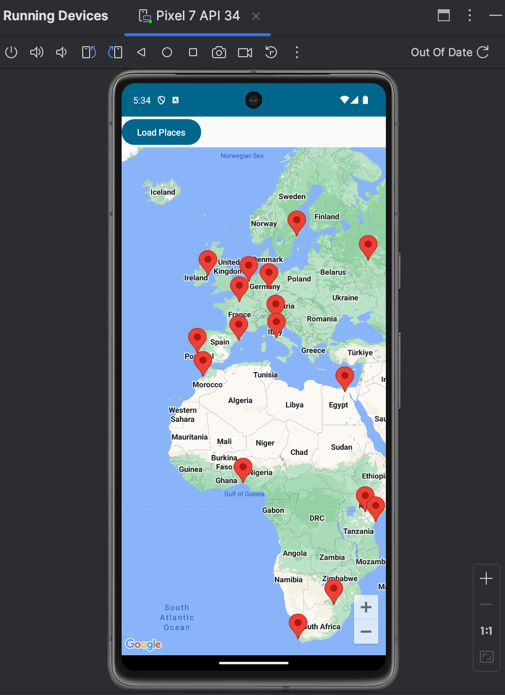

# Jetpack Compose Maps Starter

This is a starter project for Jetpack Compose using the Compose Maps Library

https://github.com/googlemaps/android-maps-compose

This is built using the repository pattern and with a view model.

```kotlin
@Composable
fun Map(modifier: Modifier = Modifier) {

    val placesViewModel: PlacesViewModel =
        viewModel(factory = PlacesViewModel.Factory)

    val cameraPositionState = rememberCameraPositionState {
        position = CameraPosition.fromLatLngZoom(LatLng(0.0,0.0), 0f)
    }
    Column {
        Button(onClick = { placesViewModel.retrievePlaces() }) {
            Text("Load Places")
        }
        GoogleMap(
            modifier = Modifier.fillMaxSize(),
            cameraPositionState = cameraPositionState
        ){
            for(place in placesViewModel.places.value){
                AdvancedMarker(
                    state = MarkerState(position = place)
                )
            }
        }
    }
}
```

Essentially, the repository is called when the "Load Places" button is clicked.

This causes a composition of the map with the markers present.



## Maps Api Key

It is required to set your maps API key in `local.properties`

```
MAPS_API_KEY=......
```

To get an API key:

https://developers.google.com/maps/documentation/android-sdk/get-api-key